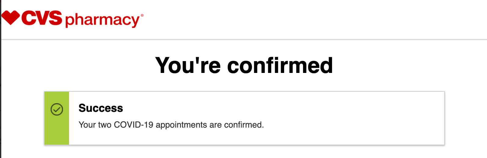

# Vaccine Watcher

Monitor Vaccine Availability from your Local CVS and Walgreens (US Only).

[](https://colab.research.google.com/github/trisongz/vaccinewatcher/blob/master/etc/Vaccine_Watcher.ipynb) 


*Disclaimer: This library is provided as is. It involves some minor browser tricks in order to properly get the availability data. Use at your own risk.*

Originally inspired from [Vaccine-hunter.js](https://github.com/mikeendale/vaccine-hunter), I wanted to write a pythonic version of it. Somewhat ironically, right after publishing and running it, availability popped up.

## What does it do

1. You can run it as a command line program.
2. You can run it pythonically through the VaccineWatcher object class - either with real-time polling, or on-demand.
   
It currently polls CVS and Walgreen's Website through a modified Selenium called [Selenium-wire](https://github.com/wkeeling/selenium-wire) to be able to access the headers and parse the response data. Both CVS and Walgreens use different detectors/cookies in order to determine your location, so using plain requests/sessions was a bit problematic. 

This method was the one that ensured consistency no matter which location.

Hopefully, you'll see something like this:


```bash
[VaccineWatcher] info : CVS has Available Appointments in HOUSTON, TX
```

## Prerequisites

You should have chromedriver installed and in your paths, which a typical install will do.

```bash
# linux
apt-get install chromedriver

# macos - this may cause issues if your Chrome Browser =/= to your Chromedriver version.
brew install chromedriver

# windows - sorry, I don't know.
```

## Installation

`vaccinewatcher` is on currently only available on Github since it's not stable yet:

```bash
pip install --upgrade git+https://github.com/trisongz/vaccinewatcher
```

## Quick Start

The below is the minimum required variables to run the CLI version, with optional flags for additional control.

If you have a lower-spec device, I would suggest increasing the frequency, since due to the modified Selenium, it can tend to be more memory intensive. 

```bash
# --no-cvs / disables CVS polling
# --no-wg / disables Walgreens polling
# --freq / how many secs between polling. default = 600 secs / 10 mins
# --zapier / provide a Zapier Webhook URL to send notifications to
# --verbose / enable logging for all results, regardless of options.

# make sure if you have multiple words in any variable to have them in quotations.
vaccinewatcher --city "Houston" --state "Texas" --abbr "TX" --zip "77056"
```

The Pythonic API can be accessed with more ease. Rather than importing the `VaccineWatcher` object directly, it's recommended to use `get_vaccine_watcher` which prevents multiple instances from spawning through threading.Lock. 


```python
from vaccinewatcher import get_vaccine_watcher

freq = 600
hook = None
check_wg = True 
check_cvs = True
params = {'city': 'San Francisco', 'state': 'California', 'state_abbr': 'CA', 'zipcode': '94117'}

watcher = get_vaccine_watcher(config=params, freq_secs=freq, hook=hook, check_walgreens=check_wg, check_cvs=check_cvs))

# if you want to poll on demand:
res = watcher(check_cvs=False, check_walgreens=True)
# > {'walgreens': False}

## NOTE - It is not recommended to run both a service daemon and on-demand, since the process in polling the websites is sensitive to the steps in which the data is queried. If the browser is interrupted by another call, it will likely mess up.

# to run as a thread daemon
watcher.run()

# to kill the service
watcher.close()

# Access the last captured data
res = watcher.last_check()

# results of res
# {'cvs': {'available': False, 'data': None, 'timestamp': None},
# 'walgreens': {'available': False, 'data': {'appointmentsAvailable': False, 'availabilityGroups': [], 'days': 4, 'radius': 25,
# 'stateCode': 'CA', 'stateName': 'California', 'zipCode': '94117'}, 'timestamp': '03-30-2021 07:17:24'}}
```

## More Advanced Stuff

There are a few additional settings available for the adventurous. 

### The Hook Function

The hook function is expected to receive two parameters, `message` and `data`. Below is the included example Zapier Webhook Listener. Message will only be included when availability changes - i.e. is available, rather than all the time. However, you can choose to send the data that is polled through the daemon by including `send_data=True` and `always_send=True` in the initial params, which will then always send the data to your webhook, regardless of status change.

```python

class ZapierWebhook:
    def __init__(self, url):
        self.url = url
        self.s = requests.Session()
        logger.log(f'Initialized Zapier Webhook at {self.url}')
    
    def __call__(self, message=None, data=None):
        if not message or data:
            return
        params = {}
        if message:
            params['message'] = message
        if data:
            params.update(data)
        params['timestamp'] = create_timestamp()
        r = self.s.post(self.url, json=params)
        if r.status_code == 200:
            logger.log(f'Successfully sent to Zapier Webhook: {params}')
        else:
            logger.log(f'Potential Error sending to Zapier Webhook')

```

# Final Notes




If you found this library helpful, please do share it with others. This is what is within my capabilities to help provide a resource and tool to allow others to find vaccine availibility, and help bring an end to the pandemic. If you end up using some parts of this library for something bigger, let me know! I'd love to check it out.

